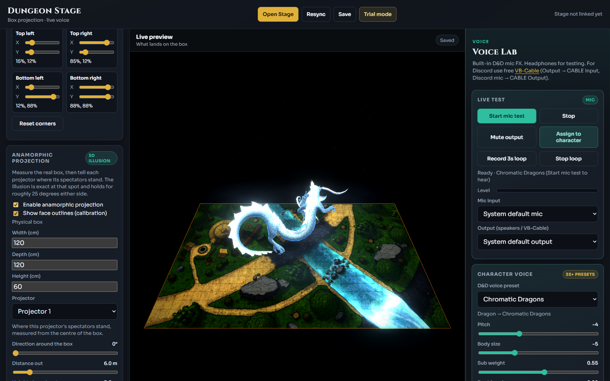

# Dungeon Stage

Project battle maps and 3D creatures onto a physical tabletop box for live D&D sessions.

Electron + Vite + Three.js. One window runs the DM controls; another drives the projector with anamorphic warp so the stage looks correct off-axis.


## Features

- **Battle maps** — Curated Barovia / Death House maps, plus your own PNG/JPEG imports
- **Room reveal (fog of war)** — Layered Death House basement and dungeon; light rooms one at a time as the party explores
- **Creatures on stage** — Place, move, scale, and rotate GLB models (Shadow Demon, Giant Spider, or custom uploads)
- **Projector alignment** — Venue box model, Mapping Studio, and corner-pin warp for real projectors
- **Stage FX** — Bloom, atmosphere, rim light, and per-map grade overrides
- **Voice** — Voicemod presets wired for live narration



## Requirements

- Node.js 18+
- Windows (portable Electron build is Windows-targeted)
- [Git LFS](https://git-lfs.github.com/) — required for the large character `.glb` files

```bash
git lfs install
git clone https://github.com/Ganesh7-exe/Dungeon-Stage.git
cd Dungeon-Stage
npm install
```

## Run

| Command | What it does |
|---|---|
| `npm run dev` | Vite browser UI (Home + Stage) |
| `npm run app:dev` | Build, then open the Electron app |
| `npm run app:exe` | Build a Windows portable `.exe` |
| `npm run generate-map-layers` | Regenerate Death House layer crops / dark bases |

Open **Open Stage** from Home once the app is running, then aim the Stage window at your projector.

## Project layout

```
electron/          Electron main + preload
src/               Home UI, Stage renderer, venue, FX, fog of war
public/maps/       Battle map images + generated layer assets
public/characters/ Creature .glb models (LFS)
scripts/           Layer generation and alignment tools
index.html         Home / control panel
stage.html         Projector stage window
mapping.html       Mapping Studio
```

## Character models

Drop matching `.glb` files into `public/characters/` and register them in `src/characters.js`. Custom models can also be added from Home at runtime.

The bundled Shadow Demon and Giant Spider files are stored with Git LFS — clone without LFS and those slots will fall back to procedural stand-ins where available.

## License

Private project unless otherwise noted. Map and model assets remain the property of their respective owners.
