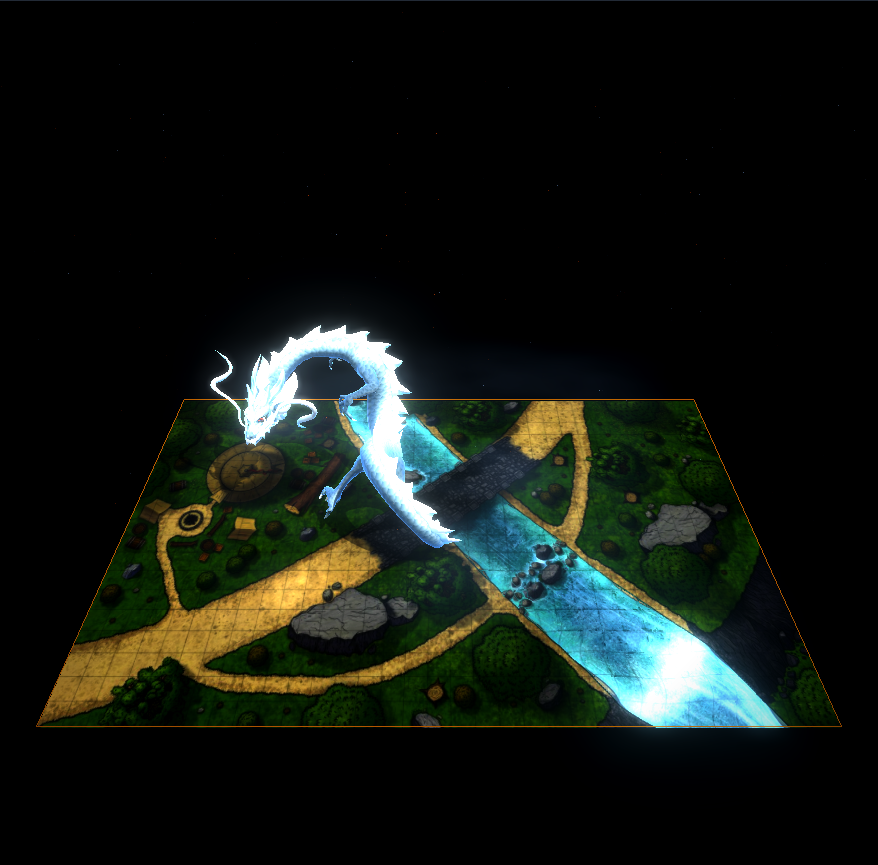

# Dungeon Stage

Project D&D battle maps and 3D creatures onto a physical tabletop box so the party sees a lit, living scene instead of a flat screen.

Built with Electron + Vite + Three.js. The DM drives everything from a control window; a second window feeds the projector with anamorphic corner-pin warp so the image looks correct from the players' side of the table.



## What it does

- **Room-by-room reveal (fog of war)** — The Death House basement and dungeon level are sliced into layered rooms. Light them one at a time from the Home panel or the Stage hotbar as the party explores; reveal state syncs live to the projector.
- **Battle maps** — Bundled Barovia / Death House set, plus your own PNG/JPEG maps imported at runtime.
- **Creatures on stage** — Place, move, scale, and rotate GLB models. Ships with a Shadow Demon and a fire-aura Giant Spider; custom models can be uploaded from Home.
- **Projector alignment** — Model the physical box, align each projector in Mapping Studio, and fine-tune with corner-pin warp.
- **Stage FX** — Bloom, atmosphere, rim light, contact shadows, and per-map grade overrides so bright indoor scans don't wash out.
- **Live voice** — Voicemod presets wired per character for in-session narration.

## Requirements

- Node.js 18+
- Windows (the portable build targets Windows)
- [Git LFS](https://git-lfs.github.com/) — the bundled character `.glb` files are stored in LFS

```bash
git lfs install
git clone https://github.com/Ganesh7-exe/Dungeon-Stage.git
cd Dungeon-Stage
npm install
```

## Run

| Command | What it does |
|---|---|
| `npm run dev` | Vite dev server (Home + Stage in the browser) |
| `npm run app:dev` | Build, then launch the Electron app |
| `npm run app:exe` | Build a Windows portable `.exe` |
| `npm run generate-map-layers` | Regenerate Death House layer crops / dark bases |

Launch the app, press **Open Stage** from Home, then move the Stage window onto your projector output.

## Project layout

```
electron/          Electron main + preload
src/               Home UI, Stage renderer, venue, FX, fog of war, map layers
public/maps/       Battle map images + generated layer assets
public/characters/ Creature .glb models (LFS)
scripts/           Layer generation and projector alignment tools
index.html         Home / control panel
stage.html         Projector stage window
mapping.html       Mapping Studio
```

## Character models

Drop `.glb` files into `public/characters/` and register them in `src/characters.js`, or add them from Home at runtime. The bundled Shadow Demon and Giant Spider are stored with Git LFS — clone without LFS and those slots fall back to procedural stand-ins where available.

## License

Private project unless otherwise noted. Map and model assets remain the property of their respective owners.
